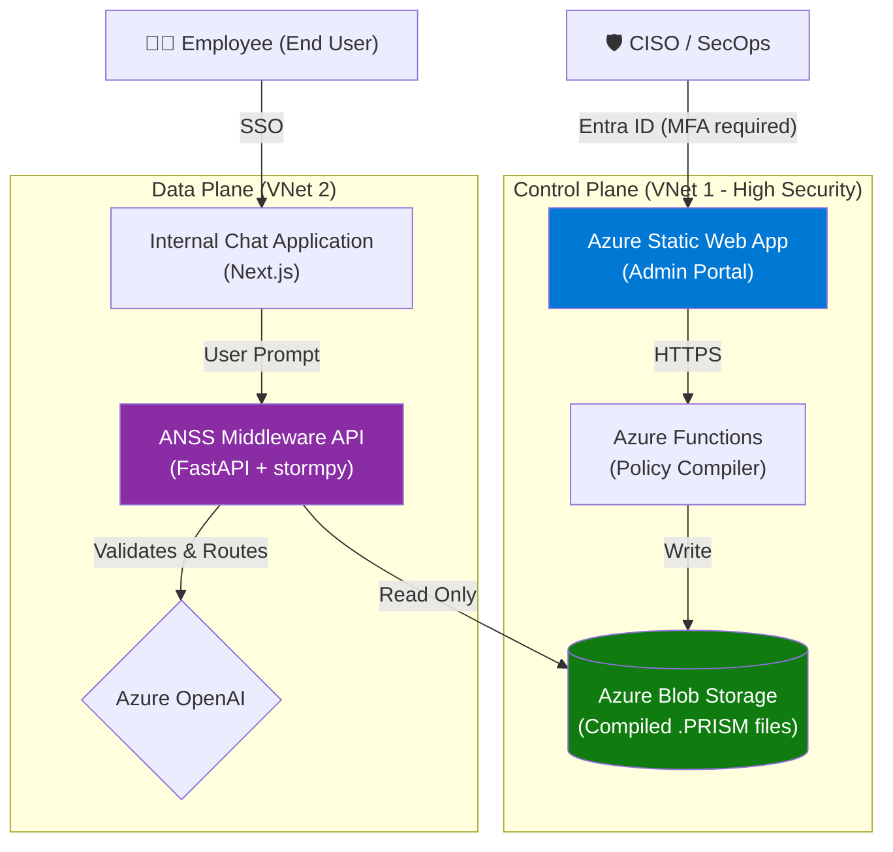

# Enterprise Architecture Recommendation

While the current setup (serving both the CISO Dashboard and the End-User Bot from the same FastAPI service) is perfect for a rapid hackathon demonstration, it violates several enterprise architecture principles, specifically around **Separation of Concerns**, **Least Privilege**, and **Scalability**.

Here is the recommended production architecture for the ANSS Platform:

## 1. Decoupled Control Plane vs. Data Plane

The system should be split into two isolated planes:

### The Control Plane (CISO Dashboard)
- **What it is:** The React/Fluent UI frontend where security teams configure PCTL rules (currently `azure_portal_fluent.html`).
- **Where it lives:** Hosted on Azure Static Web Apps or a dedicated highly restricted App Service (`admin.anss.company.com`).
- **Backend:** A dedicated Control Plane API (e.g., Azure Functions). This API validates the CISO's configurations, compiles the `.prism` files, and securely stores them in **Azure Blob Storage** or **Cosmos DB**.
- **Auth:** Strictly locked down via Entra ID (PIM - Privileged Identity Management) requiring MFA and the "Security Admin" role.

### The Data Plane (The Security Middleware)
- **What it is:** The actual FastAPI/`stormpy` validation engine processing live LLM traffic (currently `main.py` + `agent_middleware.py`).
- **Where it lives:** Hosted on Azure Container Apps or AKS behind an Azure Application Gateway inside a VNet.
- **Workflow:** It periodically fetches the latest compiled `.prism` policies from Blob Storage. It **never** exposes an API to modify these policies itself.
- **Auth:** It authenticates the end-users (the employees using the chatbot) via standard OAuth 2.0 and verifies their specific RBAC claims against the loaded PRISM models.

## 2. Decoupled Client Applications

### The End-User Bot (`/bot`)
- The end-user application (the Chat Visualizer) should **not** be served by the ANSS Middleware. 
- The Chat Application should be an independent Web App (e.g., Next.js deployed on Azure Web Apps).
- **The Flow:** 
  1. User types in the Chat App.
  2. The Chat App sends the request to the ANSS Middleware API (`/api/prompt`).
  3. The ANSS Middleware runs the Ingress Shield, verifies RAG, checks PCTL, and calls Azure OpenAI.
  4. The Middleware streams the safe response back to the independent Chat App.

## Why this Architecture?

1. **Blast Radius Isolation:** If the End-User Bot or the Middleware processing the AI traffic is compromised by a novel jailbreak, the attacker **still cannot** modify the security policies, because the Middleware has no programmatic access to rewrite the PRISM files—it only has read access. The Control Plane editing policies is on a completely separate network boundary.
2. **Independent Scaling:** In production, you might have 10,000 employees using the Bot (requiring massive horizontal scaling of the Middleware Data Plane), while only 5 CISOs use the Admin Portal.
3. **Zero-Trust Network Isolation:** The Middleware Data Plane can be placed deep inside a VNet with no inbound internet access, only accessible via Azure API Management from trusted internal apps.

## Visual Diagram

